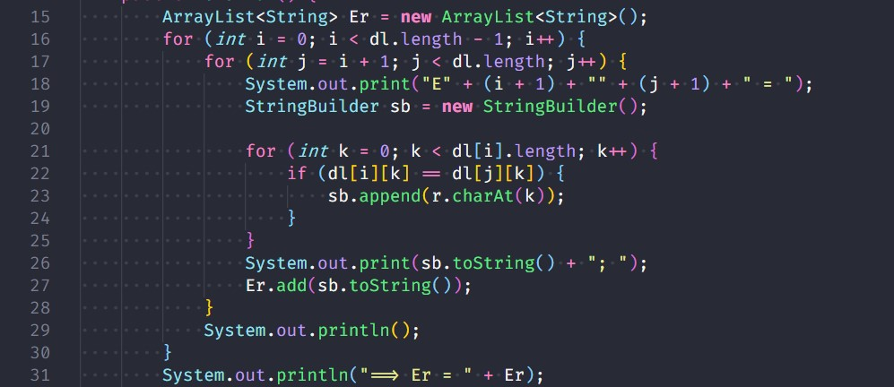

# BT nhỏ cá nhân
## [Tìm tập mục thường xuyên](Apriori.java)
### Khởi tạo contructor Apriori

### Hàm tính sup

### Hàm gộp dữ liệu của Xi với A

### Chạy VD

## [Tìm tập rút gọn](Reat.java)
### Khởi tạo contructor

### Tính Er

### Tính Md

### Tính V

### Chạy VD

## [Tìm tập rút gọn trong bảng quyết định nhất quán](Bai3.java)
### Khởi tạo contructor

### Tính Er

### Tính M

### Tính L0

### Tính Ln

### Chạy VD
